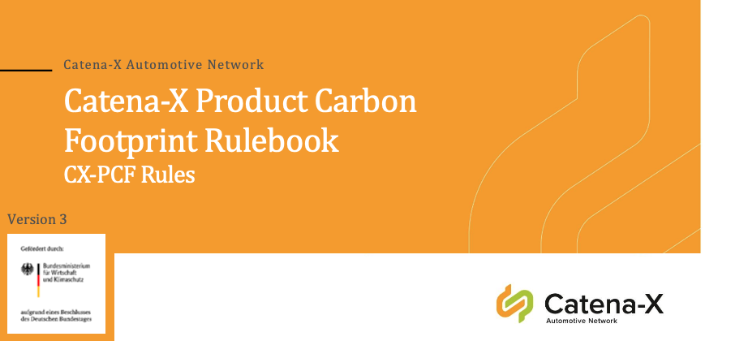
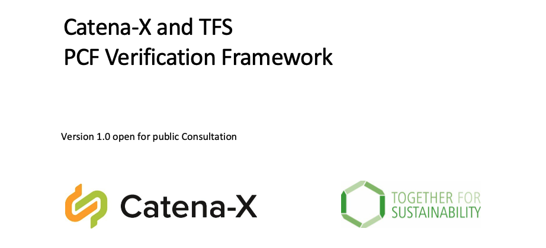
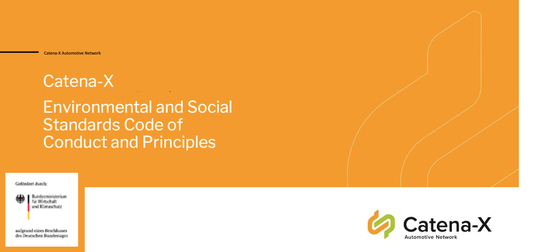

## Product Carbon Footprint

| PCF Rulebook v3.0 | PCF Verification Framework v1.0* |
|:---:|:---:|
|  |  |

:::note[\*Please note]

When you start to work with die PCF verification framework please note, that the PCF Exchange data model(s) published by Catena-X or TFS do not yet support any propagation of Verification information with specific data attribute. In order to enable gaining experience with the PCF Verification it is recommended to provide the information such as 3rd party verification share of the PCF result (3PVS in %) as comment in the PCF dataset.

:::

## ESS Code of Conduct

| ESS Code of Conduct v1.0 (German) | ESS Code of Conduct v1.0 (English) |
|:---:|:---:|
|  |  |

## Legal

Copyright © 2025 Catena-X Automotive Network e.V. All rights reserved. For more information, please visit [here](/copyright).
