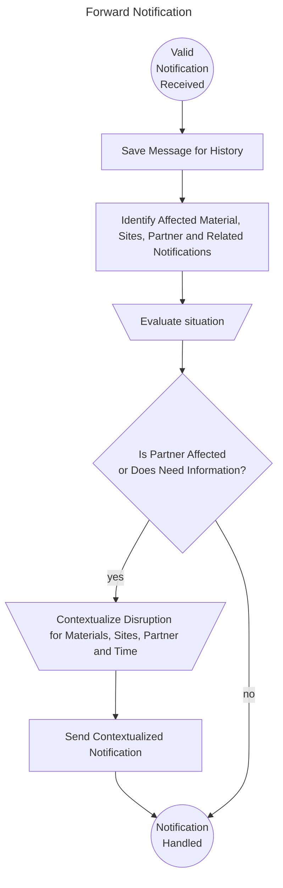

# CX-0146 Supply Chain Disruption Notifications 2.0.1

## ABSTRACT

> *This section and all its subsections are non-normative*

The Catena-X *Supply Chain Disruption Notifications* Standard is created for all members of the automotive supply chain. The aim is to have a functionality to easily and quickly inform the affected supply chain partners in case of supply chain disruptions at some point in the value chain. Having this information is key to be able to take the right countermeasures and make the whole value chain more resilient. Recent incidents (e.g. semi-conductor-crisis or COVID pandemic) have demonstrated the requirement for such a fast standardized process among all partners.

## FOR WHOM IS THE STANDARD DESIGNED

> *This section and all its subsections are non-normative*

## 1 INTRODUCTION

> *This section and all its subsections are non-normative*

This standard focuses on any kind of supply chain disruptions and aims to tackle the following challenges:

- information exchange between supply chain partners regarding their short-/mid- and long-term demand and capacity status is slow and error prone
- lack of standards complicates the exchange of information
- lack of trust between the partners involved prevents the exchange of data
- current IT solutions provide bilateral (i.e. one-to-one) data exchange and often do not scale well (i.e. one-to-n)

This often leads to shortages, high expenses for "fire fighting" in the supply chain, production disruptions, and ultimately to dissatisfied customers.

The *Supply Chain Disruption Notifications* exchange contributes to the early detection and management of supply chain disruptions (e.g. bottlenecks, capacity surpluses, etc.).

This is enabled by the following standardized components:

- common understanding of the *Supply Chain Disruption Notifications* objects as a basis for its exchange between partners in a sovereign manner through a data model and the associated semantics
- application interoperability through the description of an API for the actual notification exchange
- processes for the actual notification provisioning in order to support the contextual and legal correctness

In summary, the standardization provides a unified and streamlined method for notification exchange between supplier and customer, thus improving efficiency, reducing errors, and ensuring quick responses to any potential supply chain related challenges.

### 1.1 AUDIENCE & SCOPE

This standard is intended for:

- Data Provider
- Data Consumer
- Business Application Provider

who are involved in a customer and supplier relationship within the automotive industry.

For clarity on the roles and responsibilities of each actor, please see [Chapter 5.2](#52-actors--roles). The scope of this standard is the exchange of *Supply Chain Disruption Notifications*. It does not cover any specific countermeasures between partners in the one-to-one business relationship as a result of the notification process.

Illustrations and descriptions of roles are provided to help explain concepts and processes but are not mandatory (see [Chapter 5.2](#52-actors--roles)).

This standard requires that data consumers, providers and business application providers must adopt the uniform business logic (according to [Chapter 5](#5-processes)), data models and data exchange protocols to ensure interoperable data exchange.

This standard focuses on direct one-to-one business relationships between customers and suppliers.

### 1.2 CONTEXT AND ARCHITECTURE FIT

This standard defines the data models and APIs required for the exchange of *Supply Chain Disruption Notifications*. Implementing it ensures that:

- all actors exchange *Supply Chain Disruption Notifications* in an identical manner.
- all actors process *Supply Chain Disruption Notifications* data in an identical manner.
- all actors exchange *Supply Chain Disruption Notifications* data only via a connector conformant to [[CX-0018]](#61-normative-references).
- all actors interpret the exchanged *Supply Chain Disruption Notifications* data in an identical manner.

The APIs must only be used in the context of Catena-X and must only be accessible via a connector conformant to [[CX-0018]](#61-normative-references).

### 1.3 CONFORMANCE AND PROOF OF CONFORMITY

Non-mandatory sections include authoring guidelines, diagrams, examples and notes. All other content is mandatory.

The capitalized key words such as **MAY, MUST, MUST NOT, OPTIONAL, RECOMMENDED, REQUIRED, SHOULD** and **SHOULD NOT** are to be interpreted as defined in [BCP 14] [[RFC2119]](#62-non-normative-references) [[RFC8174]](#62-non-normative-references).

Participants must demonstrate conformity with Catena-X standards. Conformity Assessment Bodies (CABs) verify that standards are correctly applied.

**Proof of Conformity for Data Models**

Participants must implement and conform to the standardized Data Models as outlined in [Chapter 3](#3-aspect-models).

**Proof of Conformity for APIs**

Participants must implement and conform to the standardized APIs as detailed in [Chapter 4](#4-application-programming-interfaces).

**Proof of Conformity for Process & Core Business Logic**

Participants must implement and conform to the *Supply Chain Disruption Notifications* core business logic as described in [Chapter 5](#5-processes).

### 1.4 EXAMPLES

The following JSONs provide an example of the value-only serialization of the *Supply Chain Disruption Notification* aspect model for a sample notification. The notification informs about a strike resulting in a demand reduction between 12.12.2023 and 17.12.2023.

```json
{
  "notificationId": "urn:uuid:3b4edc05-e214-47a1-b0c2-1d831cdd9ba9",
  "sourceDisruptionId": "urn:uuid:a494B2EA-b8DA-AD0d-9cBe-6cf192Df09ef",
  "text": "Capacity reduction due to ongoing strike.",
  "effect": "capacity-reduction",
  "leadingRootCause": "strike",
  "status": "open",
  "contentChangedAt": "2023-12-10T14:30:00UTC",
  "startDateOfEffect": "2023-12-12T08:30:00UTC",
  "expectedEndDateOfEffect": "2023-10-17T22:00:00UTC",
  "affectedSitesSender": [
    "BPNS1234567890ZZ"
  ],
  "affectedSitesRecipient": [
    "BPNS4444444444XX"
  ],
  "materialsAffected": [
    {
      "customerMaterialNumber": "MNR-7307-AU340474.002",
      "supplierMaterialNumber": "MNR-8101-ID146955.001",
      "materialGlobalAssetId": "urn:uuid:b0ceacd8-78b0-391a-2B2D-aCB8cfAAA4AA"
    }
  ]
}
```

### 1.5 TERMINOLOGY

*The following terms are especially relevant for the understanding of the standard:*

| **Name**                                    | **Description**                                                                                                                                                                                                                                                                                                                                                                                                                                                                                                                                                                                                                                                                                                |
| ------------------------------------------- | -------------------------------------------------------------------------------------------------------------------------------------------------------------------------------------------------------------------------------------------------------------------------------------------------------------------------------------------------------------------------------------------------------------------------------------------------------------------------------------------------------------------------------------------------------------------------------------------------------------------------------------------------------------------------------------------------------------- |
| Aspect Model                                | An Aspect Model is a structured, machine-readable description of data. It utilizes the Turtle file format to serialize a Resource Description Framework (RDF) graph, that relates to a specific Aspect. It must follow the Semantic Aspect Meta Model (SAMM) guidelines, meaning it uses defined elements and rules from SAMM. Aspect Models help to clarify the meaning of data at runtime and should link to standardized Business Glossary terms, if available.                                                                                                                                                                                                                                             |
| Bottleneck                                  | A facility, function, department, or resource whose capacity is less than the demand placed upon it. For example, a bottleneck machine or work center exists where jobs are processed at a slower rate than they are demanded (Source: ASCM Supply Chain Dictionary, 17th edition).                                                                                                                                                                                                                                                                                                                                                                                                                            |
| Business Partner Number Legal Entity (BPNL) | A BPNL is a unique identifier for a company or partner within the Catena-X network.                                                                                                                                                                                                                                                                                                                                                                                                                                                                                                                                                                                                                            |
| Business Partner Number Site (BPNS)         | A BPNS is a unique identifier for a specific location, such as a factory, within the Catena-X network.                                                                                                                                                                                                                                                                                                                                                                                                                                                                                                                                                                                                         |
| Capacity                                    | 1. The capability of a system to perform its expected function. 2. The capability of a worker, machine, work center, plant, or organization to produce output per time period. (Source: ASCM Supply Chain Dictionary, 17th edition)                                                                                                                                                                                                                                                                                                                                                                                                                                                                            |
| Comment                                     | A feature that allows two business partners to exchange messages about material demand and capacity, facilitating direct collaboration and quick issue resolution.                                                                                                                                                                                                                                                                                                                                                                                                                                                                                                                                             |
| Comments                                    | These are purely text-based exchanges without the transfer of documents or attachments.                                                                                                                                                                                                                                                                                                                                                                                                                                                                                                                                                                                                                        |
| Customer                                    | A role within the I. Customers provide demands to and receive capacities from suppliers. Participating companies can have multiple roles at the same time.                                                                                                                                                                                                                                                                                                                                                                                                                                                                                                                                                     |
| Digital Twin                                | Based on [[CX-0002]](#61-normative-references) Standard a digital twin (DT) describes a digital representation of an asset sufficient to meet the requirements of a set of use cases. For detailed information please refer to [[CX-0002]](#61-normative-references) Digital Twins in Catena-X.                                                                                                                                                                                                                                                                                                                                                                                                                |
| Material                                    | The elements, constituents, or substances of which something is composed or can be made. Usually referred to by a material number.                                                                                                                                                                                                                                                                                                                                                                                                                                                                                                                                                                             |
| (Material) demand                           | A need for a particular product or component. The demand could come from any number of sources (e.g., a customer order or forecast, an interplant requirement, a branch warehouse request for a service part, or the manufacturing of another product). At the finished goods level, demand data is usually different from sales data because demand does not necessarily result in sales (i.e., If there is no stock, there will be no sale) (Source: ASCM Supply Chain Dictionary, 17th edition). Material demand may comprise multiple demand series by location and demand categories. When the term is written as one word (MaterialDemand), the term refers specifically to the respective aspect model. |
| Supplier                                    | A role within the *Supply Chain Disruption Notifications process*. Suppliers provide capacities to and receive demands from customers. Participating companies can have multiple roles at the same time.                                                                                                                                                                                                                                                                                                                                                                                                                                                                                                       |
| Surplus                                     | A surplus is a situation in which there is an oversupply.                                                                                                                                                                                                                                                                                                                                                                                                                                                                                                                                                                                                                                                      |

Table 1: *List of terminology helpful for understanding the standard*

Additional terminology used in this standard can be looked up in the glossary on the association homepage.

## 2 RELEVANT PARTS OF THE STANDARD FOR SPECIFIC USE CASES

> *This section and all its subsections are normative*

### 2.1 SUPPLY CHAIN DISRUPTION NOTIFICATIONS

#### 2.1.1 LIST OF STANDALONE STANDARDS

The following Catena-X standards are prerequisite for the implementation of this standard and therefore **MUST** be considered / implemented by the relevant parties specified in each of them.

| **Number**                            | **Standard**                        | **Version** |
| ------------------------------------- | ----------------------------------- | ----------- |
| [[CX-0001]](#61-normative-references) | EDC Discovery API                   | 1.0.2       |
| [[CX-0003]](#61-normative-references) | SAMM Aspect Meta Model              | 1.1.0       |
| [[CX-0006]](#61-normative-references) | Registration and initial onboarding | 2.0.0       |
| [[CX-0010]](#61-normative-references) | Business Partner Number (BPN)       | 2.0.0       |
| [[CX-0018]](#61-normative-references) | Dataspace Connectivity              | 3.0.0       |
| [[CX-0126]](#61-normative-references) | Industry Core Part Type             | 2.0.0       |
| [[CX-0151]](#61-normative-references) | Industry Core Basics                | 1.0.0       |

Table 2: *List of mandatory standards*

The usage of this standard **MAY** be complemented with the following Catena-X standards to further extend the range of shortage prevention possibilities:

| **Number**                            | **Standard**                                 | **Version** |
| ------------------------------------- | -------------------------------------------- | ----------- |
| [[CX-0118]](#61-normative-references) | Delivery Information Exchange                | 2.0.0       |
| [[CX-0120]](#61-normative-references) | Short Term Material Demand Exchange          | 2.0.0       |
| [[CX-0121]](#61-normative-references) | Planned Production Output Exchange           | 2.0.0       |
| [[CX-0122]](#61-normative-references) | Item Stock Exchange                          | 2.0.0       |
| [[CX-0128]](#61-normative-references) | Demand and Capacity Management Data Exchange | 2.0.0       |
| [[CX-0145]](#61-normative-references) | Days of Supply Exchange                      | 1.0.0       |

Table 3: *List of non-mandatory, but complementary standards*

#### 2.1.2 DATA REQUIRED

No additional data requirements.

#### 2.1.3 POLICY CONSTRAINTS FOR DATA EXCHANGE

In alignment with our commitment to data sovereignty, a specific framework governing the utilization of data within the Catena-X use cases has been outlined.  As part of this data sovereignty framework, conventions for access policies, for usage policies and for the constraints contained in the policies have been specified in standard 'CX-0152 Policy Constraints for Data Exchange'. This standard document CX-0152 **MUST** be followed when providing services or apps for data sharing/consuming and when sharing or consuming data in the Catena-X ecosystem. What conventions are relevant for what roles named in [1.1 AUDIENCE & SCOPE](#11-audience--scope) is specified in the CX-0152 standard document as well. CX-0152 can be found in the [standard library](https://catenax-ev.github.io/docs/standards/overview).

#### 2.1.4 DIGITAL TWINS AND SPECIFIC ASSET IDs

This version of the document does not define any requirements for standardized integration and governance of digital twins for a notification. *Supply Chain Disruption Notifications* do not rely on Asset Administration Shell or Digital Twin APIs. This standard utilizes the Catena-X Material Global Asset ID as an optional property in the DemandAndCapacityNotification aspect model, that needs to be compliant to standard [[CX-0126]](#61-normative-references) Industry Core: Part Type.

#### 2.1.5 Industry Core Basics

This version of the document relies on Industry Core Basics [CX-0151](#61-normative-references). It follows the following design patterns:

- The connector asset definitions are cut per api with a corresponding `dct:type`.
- The endpoints are designed per operation needed. These are steered by the `context` field.
- The notifications use the shared aspect "Message Header" to define information about the notification.
- The notifications use the content field to transfer the actual notification.
- The notifications follow the versioning scheme of Catena-X as mentioned in the Industry Core Basics.

This standard provides a the following operations that are covered in the [open api definition](./assets/DemandAndCapacityNotification-open-api-samm.yaml):

- `receive`: Receive new notifications or updates for notifications.

## 3 ASPECT MODELS

> *This section and all its subsections are normative*

### 3.1 ASPECT MODEL "Demand and Capacity Notification"

The [unique identifier](#314-identifier-of-semantic-model) for the semantic model, as specified in this standard, MUST be used to define the meaning of the data being transferred.

The JSON payload provided by data providers MUST comply with the [JSON schema](#3152-json-schema) as specified in this standard and MUST be validated against the same JSON schema by data consumers.

Within the Catena-X data space `demandAndCapacityNotifications` MUST be send using a connector, conforming to the standards [[CX-0018](#61-normative-references)] and [[CX-0002](#61-normative-references)]. It MUST be transferred using the [DemandAndCapacityNotification API](#41-demand-and-capacity-notification-api)

#### 3.1.1 INTRODUCTION

This section describes the DemandAndCapacityNotification semantic model used in the Catena-X network. For the complete semantics and detailed description of its properties refer to the SAMM model in [Chapter 3.1.5.1](#3151-rdf-turtle).

Business partners that are exchanging (sending and receiving) *Demand and Capacity Notifications* must implement the data model DemandAndCapacityNotification.

Every data provider of DemandAndCapacityNotification must provide the data conformant to the semantic model specified in this document.

Every business application relying on DemandAndCapacityNotification must be able to consume data conformant to the semantic model specified in this document.

This semantic model has been be made available in the central Semantic Hub.

Data consumers and data provider must comply with the license of the semantic model defined in [Chapter 3.1.3](#313-license).

The characteristics BPNL and BPNS must be used according to the standard [[CX-0010]](#61-normative-references).

#### 3.1.2 SPECIFICATIONS ARTIFACTS

The modeling of the semantic model specified in this document was done in accordance to the "semantic-driven workflow" to create a submodel template specification [[SMT]](#62-non-normative-references).

This aspect model is written in SAMM 2.1.0 as a modeling language conformant to [[CX-0003]](#61-normative-references) as input for the semantic driven workflow.

Like all Catena-X data models, this model is available in a machine-readable format on GitHub conformant to [[CX-0003]](#61-normative-references).

#### 3.1.3 LICENSE

This Catena-X data model is made available under the terms of the Creative Commons Attribution 4.0 International (CC-BY-4.0) license, which is available at Creative Commons.

#### 3.1.4 IDENTIFIER OF SEMANTIC MODEL

The semantic model has the unique identifier

```text
urn:samm:io.catenax.demand_and_capacity_notification:3.0.0
```

This identifier must be used by the data provider to define the semantics of the data being transferred.

#### 3.1.5 FORMATS OF SEMANTIC MODEL

##### 3.1.5.1 RDF TURTLE

The RDF turtle file, an instance of the Semantic Aspect Meta Model, is the master for generating additional file formats and serializations. It can be found under the following link:

```text
https://github.com/eclipse-tractusx/sldt-semantic-models/blob/2c3f875d00106354e90f28e3c687ee6e576cf12f/io.catenax.demand_and_capacity_notification/3.0.0/DemandAndCapacityNotification.ttl
```

The open source command line tool of the Eclipse Semantic Modeling Framework is used for generation of other file formats like for example a JSON Schema, aasx for Asset Administration Shell Submodel Template or a HTML documentation.

##### 3.1.5.2 JSON SCHEMA

A JSON Schema can be generated from the RDF Turtle file. The JSON Schema defines the Value-Only payload of the Asset Administration Shell for the API operation *"GetSubmodel"*.

```text
https://github.com/eclipse-tractusx/sldt-semantic-models/blob/2c3f875d00106354e90f28e3c687ee6e576cf12f/io.catenax.demand_and_capacity_notification/3.0.0/gen/DemandAndCapacityNotification-schema.json
```

##### 3.1.5.3 AASX

An AASX file can be generated from the RDF Turtle file. The AASX file defines one of the requested artifacts for a Submodel Template Specification conformant to [[SMT]](#62-non-normative-references).

```text
https://github.com/eclipse-tractusx/sldt-semantic-models/blob/2c3f875d00106354e90f28e3c687ee6e576cf12f/io.catenax.demand_and_capacity_notification/3.0.0/gen/DemandAndCapacityNotification.aasx
```

## 4 APPLICATION PROGRAMMING INTERFACES

> *This section and all its subsections are normative*

**Message Header**

> **Note:** This is not the HTTP Header but rather part of the HTTP Body.

When exchanging data described in this chapter, the POST request payload MUST be structured as follows:

```json
{
    "header": <messageHeader>,
    "content": {
        <DemandAndCapacityNotification>
    }
}
```

This [open api definition](./assets/DemandAndCapacityNotification-open-api-samm.yaml) provides the full specification of the endpoints each receiving notifications consisting of a header and a payload.

This format keeps the header, which includes metadata about the message, separated from the content, which includes the actual data being exchanged.

The master reference for generating additional file formats and serializations is the RDF turtle file, which is an instance of the Semantic Aspect Meta Model. The RDF turtle file for the `messageHeaderObject` is defined in a centralized shared aspect model and can be accessed at the following URL:

```text
https://github.com/eclipse-tractusx/sldt-semantic-models/blob/main/io.catenax.shared.message_header/3.0.0/MessageHeaderAspect.ttl
```

The RDF turtle file provides detailed description on how to use the message header. The following specialities for this standard need to be considered:

- `relatedMessageId` must always be set to empty.
- `context` must always be set to `CX-DemandAndCapacityNotificationAPI-Receive:2.0.0`

**Message Content**

The message content consists of a single `demandAndCapacityNotifcation` object containing a single JSON-serialization of the DemandAndCapacityDemand SAMM model (see [Chapter 3](#3-aspect-models)) following the rules defined in [Chapter 5](#5-processes).

**Message Example**

The following JSON provides an example of the value-only serialization of the *Supply Chain Disruption Notification* aspect model for a sample notification including a message header.

```json
{
  "header": {
    "messageId": "3b4edc05-e214-47a1-b0c2-1d831cdd9ba9",
    "context": "CX-DemandAndCapacityNotificationAPI-Receive:2.0.0",
    "receiverBpn": "BPNL4444444444XX",
    "senderBpn": "BPNL000000000ZH5",
    "sentDateTime": "2023-10-03T21:24:00+07:00",
    "version": "3.0.0"
  },
  "content": {
    "notificationId": "urn:uuid:3b4edc05-e214-47a1-b0c2-1d831cdd9ba9",
    "sourceDisruptionId": "urn:uuid:a494B2EA-b8DA-AD0d-9cBe-6cf192Df09ef",
    "text": "Lightning led to fire. Production down for 2 weeks.",
    "effect": "demand-reduction",
    "leadingRootCause": "natural-disaster",
    "status": "open",
    "contentChangedAt": "2023-10-05T14:30:00UTC",
    "startDateOfEffect": "2023-10-04T14:30:00UTC",
    "expectedEndDateOfEffect": "2023-10-08T14:30:00UTC",
    "affectedSitesSender": [
      "BPNS1234567890ZZ"
    ],
    "affectedSitesRecipient": [
      "BPNS4444444444XX"
    ],
    "materialsAffected": [
      {
        "customerMaterialNumber": "MNR-7307-AU340474.002",
        "supplierMaterialNumber": "MNR-8101-ID146955.001",
        "materialGlobalAssetId": "urn:uuid:b0ceacd8-78b0-391a-2B2D-aCB8cfAAA4AA"
      }
    ]
  }
}
```

### 4.1 "DEMAND AND CAPACITY NOTIFICATION" API

Within the Catena-X data space APIs MUST only be accessible via a connector, conforming to the standard [[CX-0018](#61-normative-references)].

The API MUST be registered as a data asset as defined in [Section 4.1.3](#413-data-asset-structure).

The API MUST be implemented as defined in [Section 4.1.2](#412-api-specification).

The "DemandAndCapacityNotification API" defined in this section enables the exchange of the *Demand and Capacity Notifications* between Catena-X participants in an interoperable manner. *Figure 1* shows a high level overview of the intended data exchange flow without including a Connector. In practice, the data must be exchanged via a Connector as described in [Chapter 3.1.1](#311-introduction).


Figure 1: *Demand and Capacity Notification API overview*

The API relies on synchronous communication between the involved parties.

1. The data exchange is initiated by the data provider.
2. The data provider is submitting a request to the data consumer.
3. The data consumer accepts a valid request and confirms the successful receipt.

The lifecycle of a DemandAndCapacityNotification is defined by the set of states shown in *Figure 2*. The data provider, i.e. the initiator of the *Demand and Capacity Notification*, must use the status "open" when opening a thread for the first time.

To mark a notification as resolved, the data provider must send the updated notification, where

- the `notificationId` must be equal to the notification ID of the notification that should be updated and
- the status must be equal to "resolved".

Refer to [Chapter 5](#5-processes) for the handling of notification updates.


Figure 2: *States of the Demand and Capacity Notifications*

#### 4.1.1 PRECONDITIONS AND DEPENDENCIES

To use this standard the participants must have an existing business relationship.

To participate in the Catena-X dataspace, both the data consumer and the data provider must be registered and onboarded as defined in [[CX-006]](#61-normative-references).

A dataspace connector conformant to [[CX-0018]](#61-normative-references) must be used to make the API available to network participants.

The API endpoint defined in [Chapter 4.1.2.1](#4121-api-endpoints--resources) must therefore be offered as data asset / contract offer as defined in [[CX-0018]](#61-normative-references).

#### 4.1.2 API SPECIFICATION

##### 4.1.2.1 API ENDPOINTS & RESOURCES

Catena-X participants interested in exchanging *Demand and Capacity Notifications* must define and implement a single endpoint supporting the HTTP POST request. The structure of the endpoint may be freely chosen. The address of the endpoint must be provided as part of the Data Asset defined in [Chapter 4.1.3](#413-data-asset-structure).

##### 4.1.2.2 DATA EXCHANGE

The DemandAndCapacityNotification data must be sent from the sender to the receiver using an HTTP POST request. The data format described here must be followed for the exchange of the *Demand and Capacity Notification*.

The endpoints are defined in the table below based on their role in the data exchange process.

>**Note:** Expressions in double curly braces \{\{\}\} must be substituted with a corresponding value.

| **Role** | **Endpoint**     | **Route**                                           | **REQUIRED** | **HTTP Method** | **Purpose**                                                                      |
| -------- | ---------------- | --------------------------------------------------- | ------------ | --------------- | -------------------------------------------------------------------------------- |
| Receiver | Request Endpoint | `{{DEMAND-AND-CAPACITY-NOTIFICATION-API-ENDPOINT}}` | Yes          | **POST**        | This endpoint receives the DemandAndCapacityNotification to the sender requests. |

Table 4: *Endpoint in the data exchange process*

The serialized JSON must not be larger than 15 MiB in size.

The "Demand and Capacity Notification API" endpoint must be implemented by all Catena-X participants who wish to receive DemandAndCapacityNotification data. Senders must be able to send DemandAndCapacityNotification object to their receivers.

The data payload itself must be a valid JSON string.

All attributes marked as *mandatory* in the aspect model standard must be included in the dataset. Attributes marked as *optional* may be included in the data set.

The usage of the attributes in the data model must follow the attribute descriptions of the respective aspect model and the definitions in [Chapter 3.1](#62-non-normative-references).

While some attributes are technically a string, not any string is valid. For example, each entry of affectedSitesSender must be formatted as a BPNS. In that case, the aspect model will have constraints describing how a valid value should look like.

When consuming a payload, that contains unknown properties not described within the data model but is otherwise correct, those properties must be ignored.

##### 4.1.2.3 UUID generation and handling

When exchanging DemandAndCapacityNotification data, the usage of UUIDv4 is required in order to reduce the probability of collision as well as to eliminate certain attack vectors. For technical purposes the UUIDv4 must be treated as unique within the supplier-customer relationship.

The UUIDv4 must be generated according to [RFC4122](#62-non-normative-references).

##### 4.1.2.5 AVAILABLE DATA TYPES

The API must use JSON as the payload is transported via HTTPS.

#### 4.1.3 DATA ASSET STRUCTURE

The endpoints introduced in [Chapter 4.1.2](#412-api-specification) must not be directly called neither from a provider nor from a consumer. Rather, these must be called via a connector conformant to [[CX-0018]](#61-normative-references). Therefore, the endpoints must be offered as data assets. To make these assets easily identifiable in the connector's catalog, each asset must be configured with a set of properties as described in the corresponding sections below.

The API version described in this standard must be published in the property [https://w3id.org/catenax/ontology/common#version](https://w3id.org/catenax/ontology/common#version) as version `2.0` in the asset. The requester of an asset must be able to handle multiple assets for this endpoint, being differentiated only by the version. The requester should choose the asset with the highest compatible version number implemented by themselves. If the requester cannot find a compatible version with their own, the requester must terminate the data transfer.

The following table provides an overview of the data assets that the parties must offer to be able to provision and/or consume DemandAndCapacityNotification data.

| **Party** | **REQUIRED** | **Asset**                              | **Purpose**                                                       |
| --------- | ------------ | -------------------------------------- | ----------------------------------------------------------------- |
| Consumer  | Yes          | "Demand and Capacity Notification API" | Allows a provider to submit a *Demand and Capacity Notification*. |

Table 5: *Data assets*

**Data Asset Structure for "Demand and Capacity Notification API Endpoint"**

To receive DemandAndCapacityNotification data, the receiver must register a data asset specifying the address of the "Demand and Capacity Notification API" Endpoint described in [Chapter 4.1.2](#412-api-specification).

The data asset must be configured with the set of properties as defined in the table below.

| **Property**                                                      | **Purpose**                                                                                      | **Usage & Constraints**                                                                                                                                                                              |
| ----------------------------------------------------------------- | ------------------------------------------------------------------------------------------------ | ---------------------------------------------------------------------------------------------------------------------------------------------------------------------------------------------------- |
| ***@id***                                                         | Identifier of the asset.                                                                         | The asset ID must be unique and therefore must not be reused elsewhere.                                                                                                                              |
| properties.**\<http://purl.org/dc/terms/type\>**                    | Defines the "Demand and Capacity Notification API" endpoint according to the Catena-X taxonomy.  | must be set to `{"@id": "https://w3id.org/catenax/taxonomy#DemandAndCapacityNotificationApi"}` to allow filtering the data assets catalog for the respective "Demand and Capacity Notification API". |
| properties.**\<https://w3id.org/catenax/ontology/common#version\>** | The version of the standard defining the implemented API.                                        | must correspond to the version of the standard defining the "Demand and Capacity Notification API". The value must be set to `"2.0"` for APIs implementing this standard.                            |
| dataAddress.properties. **@type**                                 | Type of the DataAddress node.                                                                    | must be set to `"DataAddress"`.                                                                                                                                                                      |
| dataAddress.properties. ***baseUrl***                             | Defines the HTTPS endpoint of the corresponding "Demand and Capacity Notification API" endpoint. | The `{{DEMAND_AND_CAPACITY_NOTIFICATION_REQUEST_ENDPOINT}}` refers to an URL under which the API endpoint is available. HTTPS transport protocol must be used.                                       |
| dataAddress.properties. ***proxyBody***                           | Defines whether the endpoint allows to proxy the HTTPS body.                                     | must be set to `"true"` to allow the API endpoint to receive a HTTPS body via the HTTPS request.                                                                                                     |
| dataAddress.properties. ***proxyMethod***                         | Defines whether the endpoint allows to proxy the HTTPS method.                                   | must be set to `"true"` to allow the API endpoint to receive POST requests.                                                                                                                          |
| dataAddress.properties. ***type***                                | Defines the type of data plane extension handling the data exchange.                             | must be set to `"HttpData"` to provide an API via an HTTPS proxy endpoint.                                                                                                                           |

Table 6: *Data assets request properties*

When searching the Catalog of a provider, a consumer must use the following properties AND their values to identify the Data Asset specifying "Demand and Capacity Notification API". In the connector Data Asset descriptions the API version valid for this standard is mentioned for the property [https://w3id.org/catenax/ontology/common#version](https://w3id.org/catenax/ontology/common#version). The requester of a Data Asset must be able to handle multiple Data Asset for this endpoint, being differentiated only by the version. The requester should choose the Data Asset set with the highest compatible version number implemented by themselves. If the requester cannot find a compatible version with their own, the requester must terminate the data transfer.

| **Property**              | **Value**                                                                       |
| ------------------------- | ------------------------------------------------------------------------------- |
| properties.***dct:type*** | `{"@id": "https://w3id.org/catenax/taxonomy#DemandAndCapacityNotificationApi"}` |

Table 7: *Data assets request properties values*

Because the data asset reflects the existing contractual relationship between a customer and its suppliers, only one data asset with the aforementioned combination of properties AND their values must be visible to the data consumer at any time to avoid ambiguity.

An example Data Asset definition is given below.

> Note: Expressions in double curly braces \{\{\}\} must be substituted with a corresponding value.

```json
{
    "@context": {
        "@vocab": "https://w3id.org/edc/v0.0.1/ns/",
        "cx-taxo": "https://w3id.org/catenax/taxonomy#",
        "cx-common": "https://w3id.org/catenax/ontology/common#",
        "dct": "https://purl.org/dc/terms/"
    },
    "@id": "{{DEMAND_AND_CAPACITY_NOTIFICATION_API_ASSET_ID}}",
    "properties": {
        "dct:type": {
            "@id": "cx-taxo:DemandAndCapacityNotificationApi"
        },
        "cx-common:version": "2.0",
        "description": "Demand and Capacity Notification API Endpoint"
    },
    "dataAddress": {
        "@type": "DataAddress",
        "type": "HttpData",
        "proxyBody": "true",
        "proxyMethod": "true",
        "baseUrl": "{{DEMAND_AND_CAPACITY_NOTIFICATION_API_ENDPOINT}}",
        "contentType": "application/json"
    }
}
```

#### 4.1.4 ERROR HANDLING

Every API endpoint defined in [Chapter 4.1.2](#412-api-specification)  must respond to incoming requests with HTTP status codes as described in [[RFC9110]](#62-non-normative-references). All of the following HTTP status codes, except for codes `200` and `201`, must be interpreted as failures. Therefore, it may be sufficient for a business application to simply check if the status code is `200` or `201` or not. If not, the request failed. The status codes for each endpoint are defined in the following sections.

**HTTP Codes for Demand and Capacity Notification Response Endpoint**

| **Status Code** | **Description**                                                                                     | **Usage**                                                                                               |
| --------------- | --------------------------------------------------------------------------------------------------- | ------------------------------------------------------------------------------------------------------- |
| `400`           | Response body malformed or validation failed as defined in [Chapter 4.1.5](#415-validating-payload) | When the HTTP Body is not matching the API description, the consumer must respond with error code `400` |
| `401`           | Not authorized                                                                                      | When the authorization of the response fails, the consumer must respond with error code `401`           |
| `404`           | Endpoint not found                                                                                  | When the HTTP path is not available, the consumer must respond with error code `404`                    |
| `405`           | Method not allowed                                                                                  | In case the HTTP call is not a POST, the provider must respond with error code `405`                    |
| `503`           | Service unavailable                                                                                 | The server is not ready to handle the request                                                           |

Table 8: *Request error handling*

Further status codes may be included in a later revision of this standard. The ability to send and receive one status code per sent or received list item might be included in a later revision of this standard.

#### 4.1.5 VALIDATING PAYLOAD

The following tables are supposed to answer questions regarding what business logic must be executed when receiving a DemandAndCapacityNotification which has been formed in a specific way.

The order of rules is indicated by the 'Number' row. The rules must be executed in exactly this order, starting from the lowest number.

The first rule that matches must be executed. All other rules must be ignored.

'value' indicates the actual value written in quotation marks and without any specific formatting (e.g. italic).

Valid value indicates that the value is valid according to aspect model, API and process.

Invalid value indicates that the value is invalid according to aspect model, API and process.

Any value indicates that the value can by anything, valid or not.

A whitespace or an empty cell indicates that for this specific rule that row is not applicable.

| Number          | 1                    |                        |
| --------------- | -------------------- | ---------------------- |
| Properties      |                      |                        |
| Meta Properties | Any property         | *invalid value*        |
|                 | All other properties | *Any value*            |
| Actions         | Business Logic       | Ignore received values |
|                 | Return Code          | `400` - Bad Request    |

| Number          | 2                     |                                                                          |
| --------------- | --------------------- | ------------------------------------------------------------------------ |
| Properties      | `affectedSitesSender` | One or more BPNS do not match to the sending Connector's registered BPNS |
| Meta Properties | Any property          |                                                                          |
|                 | All other properties  | *Any value*                                                              |
| Actions         | Business Logic        | Ignore received values                                                   |
|                 | Return Code           | `400` - Bad Request                                                      |

| Number          | 3                        |                                                              |
| --------------- | ------------------------ | ------------------------------------------------------------ |
| Properties      | `affectedSitesRecipient` | One or more BPNS do not match BPNS that I am responsible for |
| Meta Properties | Any property             |                                                              |
|                 | All other properties     | *Any value*                                                  |
| Actions         | Business Logic           | Ignore received values                                       |
|                 | Return Code              | `400` - Bad Request                                          |

| Number          | 4                    |                                                                                                                                |
| --------------- | -------------------- | ------------------------------------------------------------------------------------------------------------------------------ |
| Properties      | `notificationId`     | Valid UUID which matches a received `notificationId` of the same partner                                                       |
|                 | `contentChangedAt`   | Valid Timestamp which is older than or equal to the Timestamp of `contentChangedAt` from the previously received notification. |
| Meta Properties | Any property         |                                                                                                                                |
|                 | `senderBpn`          | Not equal to the `senderBpn` which originally sent the notification with this notificationId                                   |
|                 | All other properties | *Valid value*                                                                                                                  |
| Actions         | Business Logic       | Ignore received values due to old content                                                                                      |
|                 | Return Code          | `400` - Bad Request                                                                                                            |

| Number          | 5                    |                                                                                              |
| --------------- | -------------------- | -------------------------------------------------------------------------------------------- |
| Properties      | `notificationId`     | Valid UUID which matches a received notificationId of the same partner                       |
|                 | `status`             | Equal to "resolved"                                                                          |
| Meta Properties | Any property         |                                                                                              |
|                 | `senderBpn`          | Not equal to the `senderBpn` which originally sent the notification with this notificationId |
|                 | All other properties | *Valid value*                                                                                |
| Actions         | Business Logic       | Ignore received values                                                                       |
|                 | Return Code          | `400` - Bad Request                                                                          |

| Number          | 6                                                                                 |                                                                                 |
| --------------- | --------------------------------------------------------------------------------- | ------------------------------------------------------------------------------- |
| Properties      | Entry in `materialsAffected`                                                      | Validation needs to be performed per entry in `materialsAffected`.              |
|                 | `materialNumberCustomer`,<br />`materialNumberCustomer`,<br />`materialGlobalAssetId` | At least one of the material numbers is set.                                    |
| Meta Properties | Any property                                                                      |                                                                                 |
|                 | `senderBpn`                                                                       | Material referenced by the material numbers does not belong to the `senderBpn`. |
|                 | All other properties                                                              | *Valid value*                                                                   |
| Actions         | Business Logic                                                                    | Ignore received values                                                          |
|                 | Return Code                                                                       | `400` - Bad Request                                                             |

| Number          | 7                                                                                 |                                                                    |
| --------------- | --------------------------------------------------------------------------------- | ------------------------------------------------------------------ |
| Properties      | Entry in `materialsAffected`                                                      | Validation needs to be performed per entry in `materialsAffected`. |
|                 | `materialNumberCustomer`,<br />`materialNumberCustomer`,<br />`materialGlobalAssetId` | None of the material numbers is set.                               |
| Meta Properties | Any property                                                                      |                                                                    |
|                 | All other properties                                                              | *Valid value*                                                      |
| Actions         | Business Logic                                                                    | Ignore received values                                             |
|                 | Return Code                                                                       | `400` - Bad Request                                                |

| Number          | 8                    |                                                                                                                    |
| --------------- | -------------------- | ------------------------------------------------------------------------------------------------------------------ |
| Properties      | `notificationId`     | Valid UUID which matches a received `notificationId` of the same partner                                           |
|                 | `contentChangedAt`   | Valid Timestamp which is newer than the Timestamp of `contentChangedAt` from the previously received notification. |
| Meta Properties | Any property         |                                                                                                                    |
|                 | All other properties | *Valid value*                                                                                                      |
| Actions         | Business Logic       | Overwrite all existing values with received values                                                                 |
|                 | Return Code          | `200` - OK                                                                                                         |

| Number          | 9                    |                                                                                   |
| --------------- | -------------------- | --------------------------------------------------------------------------------- |
| Properties      | `notificationId`     | Valid UUID which does not match any received `notificationId` of the same partner |
| Meta Properties | Any property         |                                                                                   |
|                 | All other properties | *Valid value*                                                                     |
| Actions         | Business Logic       | Accept new notification                                                           |
|                 | Return Code          | `200` - OK                                                                        |

## 5 PROCESSES

> *This section and all its subsections are normative*

Companies adopting supply chain disruption notifications in Catena-X MUST conform to the processes and guidelies defined in [Chapter 5](#5-processes) and all its subsections.

### 5.1 SUPPLY CHAIN DISRUPTION NOTIFICATION PROCESS

*Supply Chain Disruption Notifications* (further referred to as "notification(s)" in [Chapter 5](#5-processes)) are a collaboration functionality business partners may use to interact with each other. Focus is to quickly inform the relevant business partners in the supply chain about an upcoming disruption. Notifications functionality should be used by any value chain partner, if the expected impact goes beyond the regular one-to-one business relationship between one-up and one-down and might therefore be relevant for part or even the whole supply chain network. Typical cases in real business are force major events (e.g. natural disaster, production incidents, wars, pandemics etc.) or production incident (e.g. equipment failures, power or IT issues, labor shortages, quality or safety incidents, etc.). Even though a notification must be always sent between one-up and one-down partner, the intention is, that the recipient will further forward the adjusted notification up or down the supply chain. If, after internal evaluation, the recipient decides to inform further business partners, the notification must be modified and cannot simply be identically forwarded. This results into a new notification ID.

Therefore a partner must be able to receive and process notifications. Being able to send notifications is highly recommended in order to participate in a collaborative environment and make full use of the notifications feature. Furthermore, notifications must work in both directions (up- and downstream). In case a business partner needs to send a notification up- and downstream the supply chain at the same time, two individual notifications must be sent resulting into individual notification IDs (see Figure 3).

The notification consists of a message header and a notification payload (see Table 9) which must be filled by the sender of the notification and are explained in the mentioned tables. Mandatory (M) fields must be filled to correctly send a notification and optional (O) fields must be filled by the sender. Once completely and correctly filled, the notification can be shared with one-up or one-down business partners. Each partner receiving a notification must decide, after having evaluated the impact, if they need to inform their potentially affected business partners up- or downstream the supply chain (depending on the notification direction) following the same process logic as written above. Each new notification must receive its individual notification ID and a sender of a notification must link a reference to a previously sent notification ID or source disruption ID. Only the referred notification ID itself is added to the notification (neither content nor other information e.g. at which tier-level the incident started). If several value chain partners e.g. refer to the same initially shared notification ID within their notification, a recipient is able to understand the impact of the problem. The sender of the notification must respect data privacy laws and must follow antitrust rules. Update of further objects (e.g. MaterialDemand) is not directly part of the notifications functionality as this happens in separate collaboration between one-up and one-down (e.g. comment function). Updating a notification content results into an update of the ContentChangedAt using the same notification ID. With that information the recipient is able to identify when the content of the original notification was updated. Resolving a notification must be done only by the sender and this update of the notification follows the same logic via new ContentChangedAt timestamp as described before.

**Demand and Capacity Notification Payload Description**

| **Field name / Structure**                     | **Mandatory** / **Optional** | **Data type**              | **Description**                                                                                                                                                                                                                                                                                              | **Example**                                                                                                                      |
| ---------------------------------------------- | ---------------------------- | -------------------------- | ------------------------------------------------------------------------------------------------------------------------------------------------------------------------------------------------------------------------------------------------------------------------------------------------------------ | -------------------------------------------------------------------------------------------------------------------------------- |
| **Notification ID**                            | M                            | UUID                       | Unique ID identifying the notification.                                                                                                                                                                                                                                                                      | `urn:uuid:d9452f24-3bf3-4134-b3eb-68858f1b2362`                                                                                  |
| **Affected Sites Sender**                      | O                            | Collection - BPNS - String | The affected Business Partner site Numbers of the sender.It is recommended to send the senderBpns. It must be possible to select multiple senderBpns.                                                                                                                                                        | `BPNS7588787849VQ`                                                                                                               |
| **Affected Sites Recipient**                   | O                            | Collection - BPNS - String | The affected Business Partner site Numbers of the recipient. It is recommended to send the recipient Bpns. It must be possible to select multiple recipient BPNS.                                                                                                                                            | `BPNS6666787765VQ`                                                                                                               |
| **Leading Root Cause**                         | M                            | Enumeration                | Possible values: <br /> - strike <br /> - natural disaster <br /> - production incident <br /> - pandemic / epidemic <br /> - logistics disruption <br /> - war <br /> - insolvency <br /> - other                                                                                                                               | `strike`                                                                                                                         |
| **Effect**                                     | M                            | Enumeration                | Notification Category / ImpactFrom a business perspective, demand or capacity reduction are the most relevant values in connection with above mentioned root causes. For technical completeness demand or capacity increase are also added to the value list.                                                | `demand-reduction`, `capacity-reduction`, `capacity-increase`, `demand-increase`                                                 |
| **Resolving Measure Description**              | O                            | String                     | Text describing how the sender of the notification has resolved the disruption. Set when resolving a notification.                                                                                                                                                                                           | `We buffered the disruption period with safety stock. Alternative transports have been arranged to replenish the safety stocks.` |
| **Text**                                       | O                            | String                     | Free text to describe the disruption and its handling in the notification (max. 4000 characters). Ensure to not reveal third-party information. Provide information about the disruption, the context within your customer-supplier-relationship, already aligned and taken measures and updates on the progress and changes. MUST be set when creating, updating or forwarding notifications. CAN be set when resolving (set status to resolved) a notification.                                                                                                                                                                                                                                                | `"Lightning led to fire. Production down for 2 weeks."`                                                                                                                   |
| MaterialsAffected.**Material Number Customer** | O                            | String                     | If the customer is the sender to send Customer Material number is recommended. It must be possible to send n customer material numbers.                                                                                                                                                                      | `MNR-7307-AU340474.002`                                                                                                          |
| MaterialsAffected.**Material Number Supplier** | M                            | String                     | Must always be set following Industry Core Conventions [CX-0126](#61-normative-references). It must be possible to send n supplier material numbers.                                                                                                                                                         | `MNR-8101-ID146955.001`                                                                                                          |
| MaterialsAffected.**Material Global Asset ID** | O                            | String                     | MaterialGlobalAssetID references a digital twin. Via a digital twin a recipient is able to identify the own affected material numbers as the digital twin connects sender and recipient material numbers. If a digital twin is available it is RECOMMENDED only exchanging the digital twin material number. | `urn:uuid:48878d48-6f1d-47f5-8ded-a441d0d879df`                                                                                  |
| **Start Date of Effect**                       | M                            | Timestamp                  | Expected start date of the impact must be shared by the sender of the message.This also applies to cases where the sending of the message and start date of the effect differ from each other.                                                                                                               | `2023-06-05T08:00:00+02:00`                                                                                                      |
| **Expected End Date of Effect**                | O                            | Timestamp                  | Expected end date of the impact may be mentioned by the sender of the notification.                                                                                                                                                                                                                          | `2023-06-19T08:00:00+02:00`                                                                                                      |
| **Status**                                     | M                            | Enumeration                | Notification status reflecting whether the impact of the notification still has an impact on the partner.                                                                                                                                                                                                    | `"open"`, `"resolved"`                                                                                                           |
| **Content Changed At**                         | M                            | Timestamp                  | Time where any property of the notification was updated the last time.                                                                                                                                                                                                                                       | `2023-06-19T08:00:00+02:00`                                                                                                      |
| **Related Notification ID**                    | O                            | Collection - UUID          | Unique ID identifying a previously received notification triggering the exchange of the current notification. Must be set when forwarding a notification.                                                                                                                                                    | `urn:uuid:d05cef4a-b692-45bf-87cc-eda2d84e4c04`                                                                                  |
| **Source Notification ID**                     | O                            | UUID                       | Unique ID identifying a source notification related to the current one. Must be set when forwarding a notification.                                                                                                                                                                                          | `urn:uuid:c69cb3e4-16ad-43c3-82b9-0deac75ecf9e`                                                                                  |

Table 9: *Demand and Capacity Notification Payload Description*

### 5.2 ACTORS & ROLES

| **Actors**                    | **Description**                                                                                                                                                                                                                                                                                                                                                                                                                                                                        |
| ----------------------------- | -------------------------------------------------------------------------------------------------------------------------------------------------------------------------------------------------------------------------------------------------------------------------------------------------------------------------------------------------------------------------------------------------------------------------------------------------------------------------------------- |
| Sender                        | The sender is the author of the notification. The sender is responsible to properly fill all necessary data fields and send the notification to its direct business partner (one-up or one-down). This means the sender acts as data provider within the notifications process and is sharing the notification with its direct business partners (one-up or one-down). Customer and supplier can both act as the sender of the notification.                                           |
| Recipient                     | The recipient receives a notification from its direct business partner (one-up or one-down). The recipient needs to check the impact and might inform its further business partners up- or downstream the value chain. This means the recipient acts as a data consumer within the notifications process as the recipient is receiving the notification from its direct business partners (one-up or one-down). Customer and supplier can both act as the recipient of a notification. |
| Business application provider | The business application provider provides and operates an application/tool which enables the notifications process and follows core business logic, data model and API as described in this standard document.                                                                                                                                                                                                                                                                        |

Table 10: *Overview of Actors & Roles*

### 5.3 PROCESS REPRESENTATION

The main steps for creating a notification are explained in detail below.
The common propagation is the forwarding and contextualization of disruptions that influence the demand and the capacity.


Figure 3: *Visualization Notifications Process with forwarding into two direction from the source disruption.*

| Partner              | Produces         | Delivers to        | Receives from                            |
| -------------------- | ---------------- | ------------------ | ---------------------------------------- |
| Tier 4.1             | steel sheets     | Tier 3.1           | -                                        |
| Tier 3.1 | nuts             | Tier 2.1, Tier 2.2 | Tier 4.1                                 |
| Tier 2.2 | steering linkage | Tier 1.2           | Tier 3.1                                 |
| Tier 1.2 | steering wheel   | OEM 1, OEM 2       | Tier 2.1, Tier 2.2                       |
| OEM1                 | Car 1            | -                  | Tier 1.2, Tier 1.1 (ignored in Figure 3) |
| OEM2                 | Car 2            | -                  | Tier 1.2                                 |

Table 11: *Summary of the supply network affected by the disruption.*

#### 5.3.1 Creating the Initial Notification

When a partner decides to inform his partners about a disruption of his demand and capacity, he creates the initial notification.

| Field name / Structure                         | Mandatory / Optional / Empty | Data type                  | Rule to set value                                                                                                               | Example                                                                          |
| ---------------------------------------------- | ---------------------------- | -------------------------- | ------------------------------------------------------------------------------------------------------------------------------- | -------------------------------------------------------------------------------- |
| **Notification ID**                            | M                            | UUID                       | Generate a new one.                                                                                                             | `urn:uuid:d9452f24-3bf3-4134-b3eb-68858f1b2362`                                  |
| **Affected Sites Sender**                      | O                            | Collection - BPNS - String | Recommended to set to the sites of the sender affected by the disruption.                                                       | `BPNS7588787849VQ`                                                               |
| **Affected Sites Recipient**                   | O                            | Collection - BPNS - String | Recommended to set to the sites of the sender affected by the disruption.                                                       | `BPNS6666787765VQ`                                                               |
| **Leading Root Cause**                         | M                            | Enumeration                | Set to the root cause of the disruption.                                                                                        | `strike`                                                                         |
| **Effect**                                     | M                            | Enumeration                | Set to the effect of the disruption with regard to the receiver.                                                                | `demand-reduction`, `capacity-reduction`, `capacity-increase`, `demand-increase` |
| **Text**                                       | M                            | String                     | Free text to describe the disruption and its handling in the notification (max. 4000 characters). Ensure to not reveal third-party information. Provide information about the disruption, the context within your customer-supplier-relationship, already aligned and taken measures and updates on the progress and changes. MUST be set when creating, updating or forwarding notifications. CAN be set when resolving (set status to resolved) a notification.                                                                                                                                                                                                                                                | `"Lightning led to fire. Production down for 2 weeks."`                                                                                                                   |
| **Resolving Measure Description**              | E                            | String                     | Don't set.                                                                                                                      | ``                                                                               |
| MaterialsAffected.**Material Number Customer** | O                            | String                     | Include all materials of the receiver affected. Set, if the customer is the sender. Either material number must be set.         | `MNR-7307-AU340474.002`                                                          |
| MaterialsAffected.**Material Number Supplier** | O                            | String                     | Include all materials of the receiver affected. Set, if the supplier is the sender. Either material number must be set.         | `MNR-8101-ID146955.001`                                                          |
| MaterialsAffected.**Material Global Asset ID** | O                            | String                     | Include all materials of the receiver affected. Set only this material number, if a digital twin is available for the material. | `urn:uuid:48878d48-6f1d-47f5-8ded-a441d0d879df`                                  |
| **Start Date of Effect**                       | M                            | Timestamp                  | Set to the expected start date of the impact on the sender.                                                                     | `2023-06-05T08:00:00+02:00`                                                      |
| **Expected End Date of Effect**                | O                            | Timestamp                  | Set to the expected end date of the impact on the sender.                                                                       | `2023-06-19T08:00:00+02:00`                                                      |
| **Status**                                     | M                            | Enumeration                | Set to `open`.                                                                                                                  | `"open"`, `"resolved"`                                                           |
| **Content Changed At**                         | M                            | Timestamp                  | Set to current time.                                                                                                            | `2023-06-19T08:00:00+02:00`                                                      |
| **Related Notification ID**                    | E                            | Collection - UUID          | Don't set.                                                                                                                      | ``                                                                               |
| **Source Disruption ID**                       | M                            | UUID                       | Generate a random UUID that is different to the `Notification ID`.                                                              | `urn:uuid:c69cb3e4-16ad-43c3-82b9-0deac75ecf9e`                                  |

Table 12: *Rules to fill a notification as the first person.*

#### 5.3.2 Forwarding a Received Notification

After receiving a message from a sender, the receiver evaluates the notification and decides whether he wants to forward the notification. If he decides to forward the notification,

- he acts as the sender of a new notification that relates to all notifications that share the same `Source Disruption ID`.
- he contextualizes the site, time, material and text information for his affected partners.



Figure 4: *Flow diagram of a forwarding progress.*

The following table describes the mandatoriness of information when forwarding a notification.

| Field name / Structure                         | Mandatory / Optional / Empty | Data type                  | Rule to set value                                                                                                                            | Example                                                                          |
| ---------------------------------------------- | ---------------------------- | -------------------------- | -------------------------------------------------------------------------------------------------------------------------------------------- | -------------------------------------------------------------------------------- |
| **Notification ID**                            | M                            | UUID                       | Generate a new one.                                                                                                                          | `urn:uuid:d9452f24-3bf3-4134-b3eb-68858f1b2362`                                  |
| **Affected Sites Sender**                      | O                            | Collection - BPNS - String | Recommended to set to the sites of the sender affected by the disruption.                                                                    | `BPNS7588787849VQ`                                                               |
| **Affected Sites Recipient**                   | O                            | Collection - BPNS - String | Recommended to set to the sites of the sender affected by the disruption.                                                                    | `BPNS6666787765VQ`                                                               |
| **Leading Root Cause**                         | M                            | Enumeration                | Copy from received notification.                                                                                                             | `strike`                                                                         |
| **Effect**                                     | M                            | Enumeration                | Copy from received notification.                                                                                                             | `demand-reduction`, `capacity-reduction`, `capacity-increase`, `demand-increase` |
| **Text**                                       | M                            | String                     | Free text to describe the disruption and its handling in the notification (max. 4000 characters). Ensure to not reveal third-party information. Provide information about the disruption, the context within your customer-supplier-relationship, already aligned and taken measures and updates on the progress and changes. MUST be set when creating, updating or forwarding notifications. CAN be set when resolving (set status to resolved) a notification.                                                                                                                                                                                                                                                | `"Lightning led to fire. Production down for 2 weeks."`                                                                                                                   |
| **Resolving Measure Description**              | E                            | String                     | Don't set.                                                                                                                                   | ``                                                                               |
| MaterialsAffected.**Material Number Customer** | O                            | String                     | Include all materials of the receiver affected. Set, if the customer is the sender. Either material number must be set.                      | `MNR-7307-AU340474.002`                                                          |
| MaterialsAffected.**Material Number Supplier** | O                            | String                     | Include all materials of the receiver affected. Set, if the supplier is the sender. Either material number must be set.                      | `MNR-8101-ID146955.001`                                                          |
| MaterialsAffected.**Material Global Asset ID** | O                            | String                     | Include all materials of the receiver affected. Set only this material number, if a digital twin is available for the material.              | `urn:uuid:48878d48-6f1d-47f5-8ded-a441d0d879df`                                  |
| **Start Date of Effect**                       | O                            | Timestamp                  | Set to the expected start date of the impact on the sender.                                                                                  | `2023-06-05T08:00:00+02:00`                                                      |
| **Expected End Date of Effect**                | O                            | Timestamp                  | Set to the expected end date of the impact on the sender.                                                                                    | `2023-06-19T08:00:00+02:00`                                                      |
| **Status**                                     | M                            | Enumeration                | Set to `open`.                                                                                                                               | `"open"`, `"resolved"`                                                           |
| **Content Changed At**                         | M                            | Timestamp                  | Set to current time.                                                                                                                         | `2023-06-19T08:00:00+02:00`                                                      |
| **Related Notification IDs**                   | Collection - M               | Collection - UUID          | Copy value of `Notification ID` of all received notifications that share the same `Source Disruption ID`, `Effect` and `Leading Root Cause`. | `urn:uuid:d05cef4a-b692-45bf-87cc-eda2d84e4c04`                                  |
| **Source Disruption ID**                       | M                            | UUID                       | Copy from received notification.                                                                                                             | `urn:uuid:c69cb3e4-16ad-43c3-82b9-0deac75ecf9e`                                  |

Table 13: *Rules to fill a notification as the first sender.*

> Note: When receiving multiple notifications with the same `sourceDisruptionId`, one has multiple `relatedNotificationIds`. As they all share the same disruption source, the fields that are mandatory to copy and mentioned in the table, will have the same value.

#### 5.3.3 Updating a Notification

Whenever the influence of a disruption on a receiver changes, the sender should provide updates via updating the corresponding notification. These updates are:

- further partners are affected by the same `Source Notification ID`
- some or all materials or sites are no longer affected
- additional materials or sites are affected
- the time period of affection may be updated
- further information on handling the disruption

| Field name / Structure                         | Mandatory / Optional / Empty | Data type                  | Rule to set value                                                                                                                            | Example                                                                          |
| ---------------------------------------------- | ---------------------------- | -------------------------- | -------------------------------------------------------------------------------------------------------------------------------------------- | -------------------------------------------------------------------------------- |
| **Notification ID**                            | M                            | UUID                       | Copy from notification to update.                                                                                                            | `urn:uuid:d9452f24-3bf3-4134-b3eb-68858f1b2362`                                  |
| **Affected Sites Sender**                      | O                            | Collection - BPNS - String | Recommended to set to the sites of the sender affected by the disruption.                                                                    | `BPNS7588787849VQ`                                                               |
| **Affected Sites Recipient**                   | O                            | Collection - BPNS - String | Recommended to set to the sites of the sender affected by the disruption.                                                                    | `BPNS6666787765VQ`                                                               |
| **Leading Root Cause**                         | M                            | Enumeration                | Copy from notification to update.                                                                                                            | `strike`                                                                         |
| **Effect**                                     | M                            | Enumeration                | Copy from notification to update.                                                                                                            | `demand-reduction`, `capacity-reduction`, `capacity-increase`, `demand-increase` |
| **Text**                                       | M                            | String                     | Free text to describe the disruption and its handling in the notification (max. 4000 characters). Ensure to not reveal third-party information. Provide information about the disruption, the context within your customer-supplier-relationship, already aligned and taken measures and updates on the progress and changes. MUST be set when creating, updating or forwarding notifications. CAN be set when resolving (set status to resolved) a notification.                                                                                                                                                                                                                                                | `"Lightning led to fire. Production down for 2 weeks."`                                                                                                                   |
| **Resolving Measure Description**              | E                            | String                     | Don't set.                                                                                                                                   | ``                                                                               |
| MaterialsAffected.**Material Number Customer** | O                            | String                     | Include all materials of the receiver affected. Set, if the customer is the sender. Either material number must be set.                      | `MNR-7307-AU340474.002`                                                          |
| MaterialsAffected.**Material Number Supplier** | O                            | String                     | Include all materials of the receiver affected. Set, if the supplier is the sender. Either material number must be set.                      | `MNR-8101-ID146955.001`                                                          |
| MaterialsAffected.**Material Global Asset ID** | O                            | String                     | Include all materials of the receiver affected. Set only this material number, if a digital twin is available for the material.              | `urn:uuid:48878d48-6f1d-47f5-8ded-a441d0d879df`                                  |
| **Start Date of Effect**                       | M                            | Timestamp                  | Set to the expected start date of the impact on the sender.                                                                                  | `2023-06-05T08:00:00+02:00`                                                      |
| **Expected End Date of Effect**                | O                            | Timestamp                  | Set to the expected end date of the impact on the sender.                                                                                    | `2023-06-19T08:00:00+02:00`                                                      |
| **Status**                                     | M                            | Enumeration                | Notification status. When the notification is updated but not resolved, it must remain in status `open`.                                     | `"open"`, `"resolved"`                                                           |
| **Content Changed At**                         | M                            | Timestamp                  | Set to current time.                                                                                                                         | `2023-06-19T08:00:00+02:00`                                                      |
| **Related Notification IDs**                   | Collection - M               | Collection - UUID          | Copy value of `Notification ID` of all received notifications that share the same `Source Disruption ID`, `Effect` and `Leading Root Cause`. | `urn:uuid:d05cef4a-b692-45bf-87cc-eda2d84e4c04`                                  |
| **Source Disruption ID**                       | M                            | UUID                       | Copy from notification to update.                                                                                                            | `urn:uuid:c69cb3e4-16ad-43c3-82b9-0deac75ecf9e`                                  |

Table 14: *Rules to fill a notification for update.*

#### 5.3.4 Resolving a Notification

Whenever the influence of a disruption on a receiver changes, the sender should resolve the disruption via updating the corresponding notification.

| Field name / Structure                         | Mandatory / Optional / Empty | Data type         | Rule to set value                                                                                                                            | Example                                                                                                                          |
| ---------------------------------------------- | ---------------------------- | ----------------- | -------------------------------------------------------------------------------------------------------------------------------------------- | -------------------------------------------------------------------------------------------------------------------------------- |
| **Notification ID**                            | M                            | UUID              | Copy from notification to resolve.                                                                                                           | `urn:uuid:d9452f24-3bf3-4134-b3eb-68858f1b2362`                                                                                  |
| **Affected Sites Sender**                      | E                            | String            | Set to empty.                                                                                                                                | `BPNS7588787849VQ`                                                                                                               |
| **Affected Sites Recipient**                   | E                            | String            | Set to empty.                                                                                                                                | `BPNS6666787765VQ`                                                                                                               |
| **Leading Root Cause**                         | M                            | Enumeration       | Copy from notification to resolve.                                                                                                           | `strike`                                                                                                                         |
| **Effect**                                     | M                            | Enumeration       | Copy from notification to resolve.                                                                                                           | `demand-reduction`, `capacity-reduction`, `capacity-increase`, `demand-increase`                                                 |
| **Text**                                       | O                            | String                     | Free text to describe the disruption and its handling in the notification (max. 4000 characters). Ensure to not reveal third-party information. Provide information about the disruption, the context within your customer-supplier-relationship, already aligned and taken measures and updates on the progress and changes. MUST be set when creating, updating or forwarding notifications. CAN be set when resolving (set status to resolved) a notification.                                                                                                                                                                                                                                                | `"Lightning led to fire. Production down for 2 weeks."`                                                                                                                   |
| **Resolving Measure Description**              | M                            | String            | Describe how you solved the the disruption. Ensure to not reveal third party information.                                                    | `We buffered the disruption period with safety stock. Alternative transports have been arranged to replenish the safety stocks.` |
| MaterialsAffected.**Material Number Customer** | E                            | String            | Set list of materials to empty. Set to empty.                                                                                                | ``                                                                                                                               |
| MaterialsAffected.**Material Number Supplier** | E                            | String            | Set list of materials to empty. Set to empty.                                                                                                | ``                                                                                                                               |
| MaterialsAffected.**Material Global Asset ID** | E                            | String            | Set list of materials to empty. Set to empty.                                                                                                | ``                                                                                                                               |
| **Start Date of Effect**                       | M                            | Timestamp         | Set to the expected start date of the impact on the sender.                                                                                  | `2023-06-05T08:00:00+02:00`                                                                                                      |
| **Expected End Date of Effect**                | M                            | Timestamp         | Set to the end-time of the disruption within the partner relationship.                                                                       | `2023-06-19T08:00:00+02:00`                                                                                                      |
| **Status**                                     | M                            | Enumeration       | Set to `resolved`.                                                                                                                           | `"open"`, `"resolved"`                                                                                                           |
| **Content Changed At**                         | M                            | Timestamp         | Set to current time.                                                                                                                         | `2023-06-19T08:00:00+02:00`                                                                                                      |
| **Related Notification IDs**                   | Collection - M               | Collection - UUID | Copy value of `Notification ID` of all received notifications that share the same `Source Disruption ID`, `Effect` and `Leading Root Cause`. | `urn:uuid:d05cef4a-b692-45bf-87cc-eda2d84e4c04`                                                                                  |
| **Source Disruption ID**                       | M                            | UUID              | Copy from notification to resolve.                                                                                                           | `urn:uuid:c69cb3e4-16ad-43c3-82b9-0deac75ecf9e`                                                                                  |

Table 15: *Rules to fill a notification to resolve.*

## 6 REFERENCES

### 6.1 NORMATIVE REFERENCES

> *This section is normative*

| **Number** | **Standard**                        | **Version** |
| ---------- | ----------------------------------- | ----------- |
| [CX-0001]  | EDC Discovery API                   | 1.0.2       |
| [CX-0002]  | Digital Twins in Catena-X           | 2.2.0       |
| [CX-0003]  | SAMM Aspect Meta Model              | 1.2.0       |
| [CX-0006]  | Registration and initial onboarding | 2.0.1       |
| [CX-0010]  | Business Partner Number (BPN)       | 2.2.1       |
| [CX-0018]  | Dataspace Connectivity              | 3.3.1       |
| [CX-0126]  | Industry Core Part Type             | 2.1.0       |
| [CX-0151]  | Industry Core Basics                | 1.0.0       |
| [CX-0152]  | Policy Constraints For Data Exchange| 1.0.0       |

Table 16: *List of normative standards*

### 6.2 NON-NORMATIVE REFERENCES

> *This section is non-normative*

| **Number** | **Standard**                                                                                                                                                                                | **Version** |
| ---------- | ------------------------------------------------------------------------------------------------------------------------------------------------------------------------------------------- | ----------- |
| [CX-0118]  | Delivery Information Exchange                                                                                                                                                               | 2.0.0       |
| [CX-0120]  | Short-term Material Demand Exchange                                                                                                                                                         | 2.0.0       |
| [CX-0121]  | Planned Production Output Exchange                                                                                                                                                          | 2.0.0       |
| [CX-0122]  | Item Stock Exchange                                                                                                                                                                         | 2.0.0       |
| [CX-0128]  | Demand and Capacity Management Data Exchange                                                                                                                                                | 2.0.0       |
| [CX-0145]  | Days of Supply Exchange                                                                                                                                                                     | 1.0.0       |
| [ISO8601]  | ISO 8601: Date and time format                                                                                                                                                              |             |
| [RFC2119]  | Bradner, S. Key words for use in RFCs to Indicate Requirement Levels. Available online: [https://datatracker.ietf.org/doc/html/rfc2119](https://datatracker.ietf.org/doc/html/rfc2119)                                                     |             |
| [RFC4122]  | A Universally Unique Identifier (UUID) URN Namespace ([https://www.rfc-editor.org/rfc/rfc4122](https://www.rfc-editor.org/rfc/rfc4122))                                                                                             |             |
| [RFC8174]  | Leiba, B. Ambiguity of Uppercase vs Lowercase in RFC 2119 Key Words. Available online: [https://datatracker.ietf.org/doc/html/rfc8174](https://datatracker.ietf.org/doc/html/rfc8174)                                                      |             |
| [RFC9110]  | HTTP Semantics ([https://www.rfc-editor.org/rfc/rfc9110](https://www.rfc-editor.org/rfc/rfc9110))                                                                                                                                   |             |
| [SMT]      | How to create a submodel template specification. Guideline. Download from: [https://industrialdigitaltwin.org/wp-content/uploads/2022/12/I40-IDTA-WS-Process-How-to-write-a-SMT-FINAL-.pdf](https://industrialdigitaltwin.org/wp-content/uploads/2022/12/I40-IDTA-WS-Process-How-to-write-a-SMT-FINAL-.pdf) |             |

Table 17: *List of non-normative standards*

### 6.3 REFERENCE IMPLEMENTATIONS

> *This section is non-normative*

Not applicable.

## ANNEXES

> *This section and all its subsections are non-normative*

### FIGURES

| **Figure** | **Name**                                                                                             | **Chapter**                                      |
| ---------- | ---------------------------------------------------------------------------------------------------- | ------------------------------------------------ |
| Figure 1   | *Demand and Capacity Notification API overview*                                                      | [4.1](#41-demand-and-capacity-notification-api)  |
| Figure 2   | *States of the Demand and Capacity Notifications*                                                    | [4.1](#41-demand-and-capacity-notification-api)  |
| Figure 3   | *Visualization Notifications Process with forwarding into two directions from the source disruption* | [5.3](#53-process-representation)                |
| Figure 4   | *Flow diagram of a forwarding progress*                                                              | [5.3.2](#532-forwarding-a-received-notification) |

Table 13: *List of Figures*

### TABLES

| **Table** | **Name**                                                     | **Chapter**                                             |
| --------- | ------------------------------------------------------------ | ------------------------------------------------------- |
| Table 1   | *List of terminology helpful for understanding the standard* | [1.5](#15-terminology)                                  |
| Table 2   | *List of mandatory standards*                                | [2.1.1](#211-list-of-standalone-standards)              |
| Table 3   | *List of* *non-mandatory, but* *complementary standards*     | [2.1.1](#211-list-of-standalone-standards)              |
| Table 4   | *Endpoint in the data exchange process*                      | [4.1.2.2](#4122-data-exchange)                          |
| Table 5   | *Data assets*                                                | [4.1.3](#413-data-asset-structure)                      |
| Table 6   | *Data assets request properties*                             | [4.1.3](#413-data-asset-structure)                      |
| Table 7   | *Data assets request properties values*                      | [4.1.3](#413-data-asset-structure)                      |
| Table 8   | *Request error handling*                                     | [4.1.4](#414-error-handling)                            |
| Table 9   | *Demand and Capacity Notification Payload Description*       | [5.1](#51-supply-chain-disruption-notification-process) |
| Table 10  | *Overview of Actors & Roles*                                 | [5.2](#52-actors--roles)                                |
| Table 11  | *Summary of the supply network affected by the disruption*   | [5.3](#53-process-representation)                       |
| Table 12  | *Rules to fill a notification as the first person*           | [5.3.1](#531-creating-the-initial-notification)         |
| Table 13  | *Rules to fill a notification as the first sender*           | [5.3.2](#532-forwarding-a-received-notification)        |
| Table 14  | *Rules to fill a notification for update*                    | [5.3.3](#533-updating-a-notification)                   |
| Table 15  | *Rules to fill a notification to resolve*                    | [5.3.4](#534-resolving-a-notification)                  |
| Table 16  | *List of normative standards*                                | [6.1](#61-normative-references)                         |
| Table 17  | *List of non-normative standards*                            | [6.2](#62-non-normative-references)                     |
| Table 18  | *List of Figures*                                            | [Annexes](#annexes)                                     |
| Table 19  | *List of Tables*                                             | [Annexes](#annexes)                                     |

Table 19: *List of Tables*

## Legal

Copyright  2025 Catena-X Automotive Network e.V. All rights reserved. For more information, please visit [here](/copyright).
