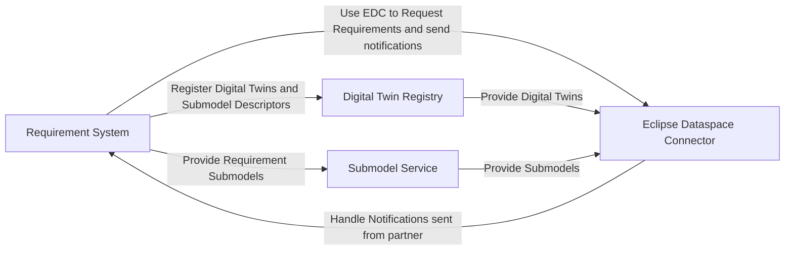
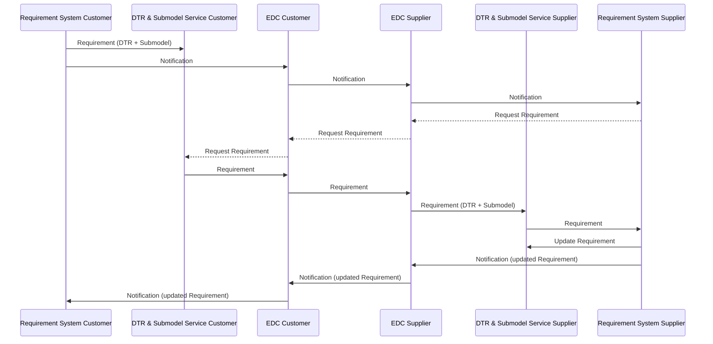

# CX-0155 Requirements Engineering v.1.0.1

## ABSTRACT

This standard focuses on the Requirement exchange use case. This includes relevant requirements for:

- data provider, that want to provide Requirements through Catena-X,
- data consumer, that are want to consume Requirements via Catena-X and
- application developer/ provider supporting the exchange of Requirements.

It will provide information about the used core components as well as the structure of the Digital Twin Registry entry, the data model exchanged and the EDC (Eclipse Dataspace Connector) data structure.

## FOR WHOM IS THE STANDARD DESIGNED

## 1 INTRODUCTION

Enabling seamless, secure, and efficient cross-company collaboration within the Catena-X ecosystem, this requirement exchange standard introduces a unified, ReqIF-inspired platform that ensures real-time, standardized, and sovereign data sharing between OEMs and suppliers, empowering stakeholders to manage, exchange, and validate requirements transparently and collaboratively across the supply chain while maintaining full control over proprietary information, enhancing interoperability, accelerating innovation, and ensuring compliance with industry standards through a flexible, structured, and trustworthy digital environment.

### 1.1 AUDIENCE & SCOPE

This standard is relevant for the following audience:

- Data Provider / Consumer
- Business Application Provider

This document focuses on Requirements in existing Supplier-OEM-Relationships which is exchanged before the actual physical asset is created.

Out-of-scope is:

- The exchange of instance specific information (see [CX-0127 Industry Core PartInstance](https://catenax-ev.github.io/docs/standards/CX-0127-IndustryCorePartInstance))
- The exchange of Master Data before the Supplier-OEM-Relationship is defined.

### 1.2 CONTEXT AND ARCHITECTURE FIT

The flowchart illustrates the interactions between four main components in the system:

#### Components

- **Requirement System**: Core component responsible for requirement management
- **Digital Twin Registry**: Stores and manages digital twin information
- **Submodel Service**: Handles submodel data and operations
- **Eclipse Dataspace Connector (EDC)**: Facilitates data exchange between partners

#### Interactions

The system architecture demonstrates how components interact to facilitate requirement exchange:

- **Requirement System Operations**

  - Registers Digital Twins and Submodel Descriptors in the Digital Twin Registry
  - Provides Requirement Submodels to the Submodel Service
  - Uses the Eclipse Dataspace Connector to request requirements and send notifications

- **Eclipse Dataspace Connector (EDC)**

  - Handles notifications sent from partners back to the Requirement System
  - Acts as the communication bridge between partners

- **Digital Twin Registry**

  - Provides Digital Twins to the Eclipse Dataspace Connector

- **Submodel Service**

  - Provides Submodels to the Eclipse Dataspace Connector



### 1.3 CONFORMANCE AND PROOF OF CONFORMITY

> *This section is non-normative*

As well as sections marked as non-normative, all authoring guidelines, diagrams, examples, and notes
in this specification are non-normative. Everything else in this specification is normative.

The key words **MAY**, **MUST**, **MUST NOT**, **OPTIONAL**, **RECOMMENDED**, **REQUIRED**, **SHOULD**
and **SHOULD NOT** in this document are to be interpreted as described in BCP 14 [RFC2119] [RFC8174]
when, and only when, they appear in all capitals, as shown here.

All participants and their solutions will need to prove, that they are conform with the Catena-X standards.
To validate that the standards are applied correctly, Catena-X employs Conformity Assessment Bodies (CABs).

To prove conformance with the standard a participant (consumer, provider or application developer) MUST show that they can consume a requirement, update the status of this requirement and send it via notification to another participant.

### 1.4 EXAMPLES

The sequence diagram illustrates the requirement exchange flow between a Customer (e.g., an OEM) and a Supplier:

\1. **Initial Requirement Creation**:

- Customer creates a requirement in their requirements system and registers it in their DTR and creates a submodel.
- Customer's system sends a notification through the EDC to the Supplier

\2. **Requirement Request**:

- Supplier's system requests the requirement details through the EDC
- The requirement is transferred from Customer's DTR to Supplier's DTR and submodel service

\3. **Requirement Update**:

- After processing, Supplier updates the requirement in their requirements system
- Supplier sends a notification about the update through the EDC back to the Customer
- Customer is notified about the requirement update

\4. **Next interactions**:

- The process can be repeated for further updates or new requirements in an interactive manner between the Customer and Supplier.

The diagram shows the core components involved in this exchange:

- Requirement Systems (on both Customer and Supplier sides)
- Digital Twin Registry (DTR) & Submodel Services
- Eclipse Dataspace Connector (EDC) for secure data exchange
- Solid lines indicate dataflow
- Dashed lines indicate initialization of a request



## 2 RELEVANT PARTS OF THE STANDARD FOR SPECIFIC USE CASES

> *This section is normative*

### 2.1 DIGITAL TWINS AND SPECIFIC ASSET IDs

The Digital Twin MUST be described either as ``PartRole`` or as ``PartType``.
If both are are possible ``PartType`` shall be used.

Specific asset IDs are used to identify digital twins when looking up or searching for these digital twins.
This is a required to connect the digital twins of the planned parts to its digital twins.
Mandatory specific asset IDs ensure that at least this information is available for the digital twin.

| Key | Availability | Description | Type |
|----------------|--------|---------------------------------------------------------------------|------|
| manufacturerId | mandatory | The Business Partner Number (BPNL) of the manufacturer of the part. | BPNL |
| digitalTwinType| mandatory | The digitalTwinType has to be set to `digitalTwinType="PartType"` or `digitalTwinType="PartRole"`. Without this filter, a search for a particular manufacturer part ID would not only return the digital twin of the engineered part, but also all digital twins of the manufacturer that are accessible, i.e., of the corresponding serial parts. | String |

## 2.2 POLICY CONSTRAINTS FOR DATA EXCHANGE

In alignment with our commitment to data sovereignty, a specific framework governing the utilization of data within the Catena-X use cases has been outlined.  As part of this data sovereignty framework, conventions for access policies, for usage policies and for the constraints contained in the policies have been specified in standard 'CX-0152 Policy Constraints for Data Exchange'. This standard document CX-0152 **MUST** be followed when providing services or apps for data sharing/consuming and when sharing or consuming data in the Catena-X ecosystem. What conventions are relevant for what roles named in [1.1 AUDIENCE & SCOPE](#11-audience--scope) is specified in the CX-0152 standard document as well. CX-0152 can be found in the [standard library](https://catenax-ev.github.io/docs/standards/overview).

The following usage purpose **MUST** be registered for data exchange in the use case:

|Type | Subject | Description | Version | Usage Purpose |
|---| ----| ---- |----| ---|
|cx-taxo:Engineering | cx-taxo:ReadAccessEngineering | Data consumer are allowed to use the data for <br /> • Collaborative engineering of products (e.g., 3D Designs, Simulations) <br /> • regulatory compliance use cases (e.g., material information in master data for secondar material content checks) <br />• Mock-Up and integration (e.g., collision checks in 3D) <br /> • versioning & release notifications of products (e.g., new product version that shall be used in a new product generation) <br /> • interface alignments (e.g., between interacting systems on physical, logical and functional level) <br /> They explicitly **MUST not** use the data for reverse engineering, e.g., by using material classifications for building the product themselves. | 1 | cx.enginnering:1 |

<!---
Data consumer are allowed to use the data for
• Collaborative engineering of products (e.g., 3D Designs, Simulations)
• regulatory compliance use cases (e.g., material information in master data for secondar material content checks)
• Mock-Up and integration (e.g., collision checks in 3D)
• versioning & release notifications of products (e.g., new product version that shall be used in a new product generation)
• interface alignments (e.g., between interacting systems on physical, logical and functional level)
They explicitly MUST not use the data for reverse engineering, e.g., by using material classifications for building the product themselves.

-->

## 3 ASPECT MODELS

> *This section is normative*

### 3.1 ASPECT MODEL "REQUIREMENT"

This semantic model, developed for the Catena-X data space, defines a standardized structure for exchanging product and process requirements.
It establishes a "Requirement" aspect that includes a unique ID, detailed information, and its current status.
The model breaks down requirement information into specifics like name, type (e.g., functional, non-functional), version, description, and author.

Furthermore, it captures the status of a requirement from both the customer and supplier perspectives, including status values and timestamps.
The model also supports relationships between different requirements and allows for additional metadata and links to specification documents.

#### 3.1.1 Identifier OF SEMANTIC MODEL

The semantic model has the unique identifier:

```text
  urn:samm:io.catenax.requirement:1.0.0#
```

> *Note:*

> - The can find the corresponding Turtle file [here](https://github.com/eclipse-tractusx/sldt-semantic-models/blob/main/io.catenax.requirement/1.0.0/requirement.ttl)
> - You can find the corresponding files (Documentation, JSON Schema or AASX File, etc.) [here](https://github.com/eclipse-tractusx/sldt-semantic-models/tree/main/io.catenax.requirement/1.0.0/gen).

## 4 APPLICATION PROGRAMMING INTERFACES

> *This section is normative*

### 4.1 APIs ASSOCIATED WITH DIGITAL TWINS

This standard completely and solely builds upon the standard [CX-0002](https://catenax-ev.github.io/docs/next/standards/CX-0002-DigitalTwinsInCatenaX) Digital Twins in Catena-X.

#### DATA ASSET STRUCTURE

The Data Assets need to be registered in the EDC as follows:

> Note: Expressions in double curly braces \{\{\}\} must be substituted with a corresponding value.

```json
{
   "@context": {
      "dct": "http://purl.org/dc/terms/",
      "cx-taxo": "https://w3id.org/catenax/taxonomy#",
      "cx-common": "https://w3id.org/catenax/ontology/common#"
   },
   "@type": "Asset", 
   "@id": "{{CONNECTOR_ASSET_ID}}",
   "properties": {
      "dct:type": {"@id": "cx-taxo:Engineering"},
      "cx-common:version": "1.0",
      "aas-semantics:semanticId": {"@id":  "  urn:samm:io.catenax.requirement:1.0.0#
requirement"}   
   },
   "dataAddress": {
      "@type": "DataAddress",
      "type": "HttpData",
      "baseUrl": "{{ SUBMODEL_ENDPOINT }}",
      "proxyQueryParams": "false",
      "proxyBody": "false",
      "proxyPath": "true",
      "proxyMethod": "false",
   }
}
```

The data asset MUST contain the following properties with the corresponding values from the table above:

- ``dct:type`` for type (as @id reference), see also CX-0018
- ``cx-common:version`` for version, see also CX-0018

### 4.2 NOTIFICATIONS

This standard completely and solely builds upon the standard [CX-0151](https://catenax-ev.github.io/docs/standards/CX-0151-IndustryCoreBasics) Industry Core: Basics.

## 5 REFERENCES

### 5.1 NORMATIVE REFERENCES

> *This section is normative*

- CX-0001 EDC Discovery API v1.0.2
- CX-0002 Digital Twins in Catena-X v2.2.0
- CX-0003 SAMM Aspect Meta Model v1.1.0
- CX-0018 Dataspace Connectivity v3.1.0
- CX-0126 Industry Core: PartType 2.1.0
- CX-0151 Industry Core: Basics v1.0.0
- CX-0152 Policy Constraints for Data Exchange v1.0.0

### 5.2 NON-NORMATIVE REFERENCES

> *This section is non-normative*

- [ReqIF](https://www.omg.org/reqif/)

### 5.3 REFERENCE IMPLEMENTATIONS

> *This section is non-normative*

This section is empty.

### 5.4 LICENSES

> *This section is non-normative*

The in Section 3 referenced Aspect Models are available under the terms of the Creative Commons Attribution 4.0 International (CC-BY-4.0) license, which is available at Creative Commons.

## Legal

Copyright © 2025 Catena-X Automotive Network e.V. All rights reserved. For more information, please visit [here](/copyright).
