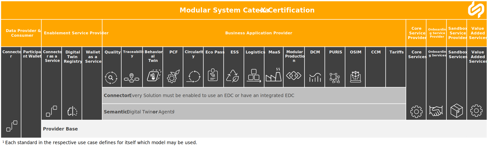
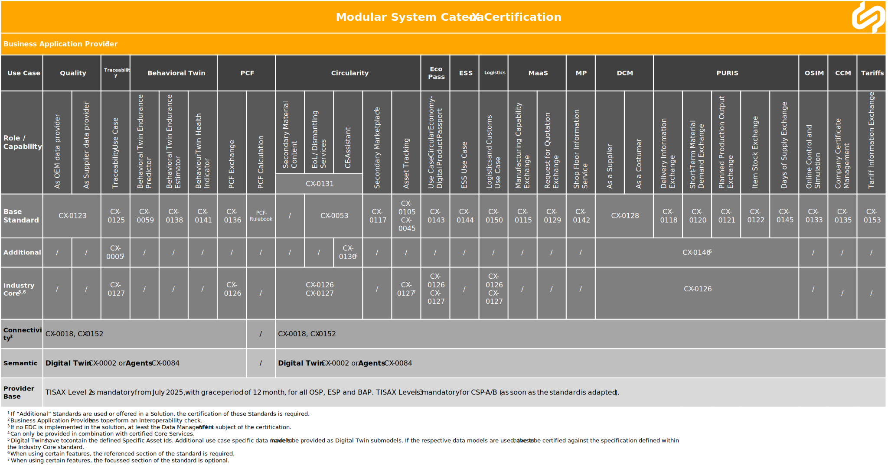

:::info[Important notification]

**CX-Saturn** is fully compatible with **CX-Io**. Business Application Providers, however, now need to certify their solutions against the **CX-Saturn standards**.
:::

The technical standards serve as the foundation for certification, ensuring technical compatibility and interoperability between independent implementations by providing uniform rules and requirements used for conformity assessment.

Certifications at Catena-X can be obtained for different types of services or solutions. The certifications are split into different "roles" indicating the type of relationship to Catena-X, as well as the"module", the specific service provided. The roles of certified companies vary between the provision of a key part of infrastructure or service ( Enablement Service Provider or Core Service provider) and complementing further solutions or services to the data space. In line with this role differentiation, the certifications have a different scope and different Catena-X standards associated with them. Companies shall always mention the specific role and module they have been awarded the certification in e.g. Connector, Traceability, MaaS.

The following figures detail the standards applicable to each of the six roles and matching modules.

## Legal

Copyright © 2025 Catena-X Automotive Network e.V. All rights reserved. For more information, please visit [here](/copyright).
